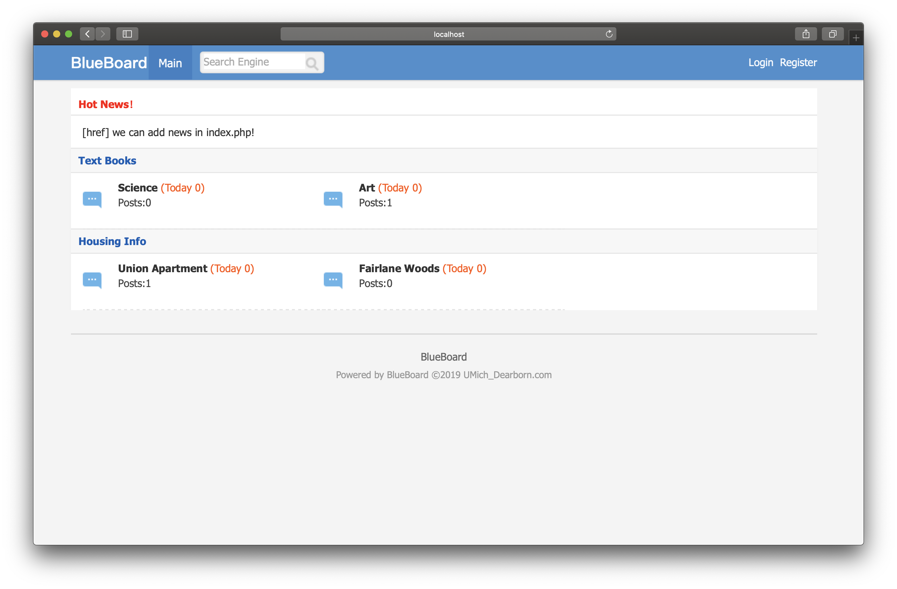
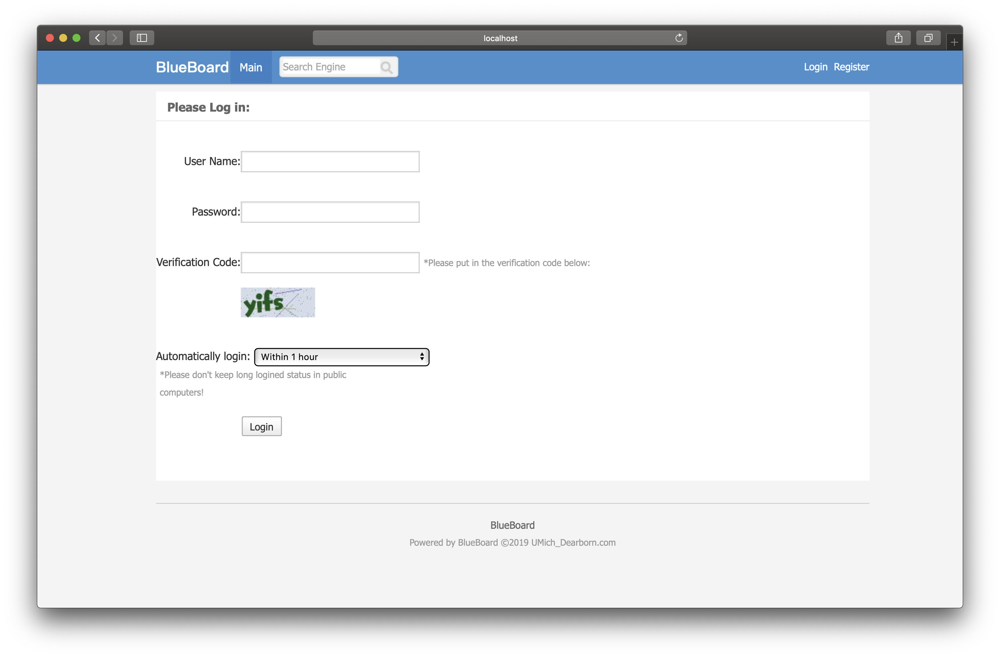
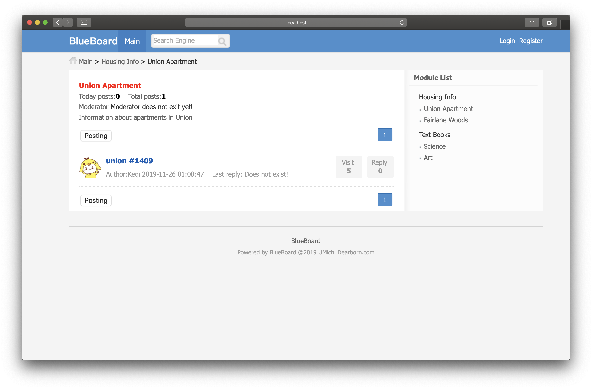
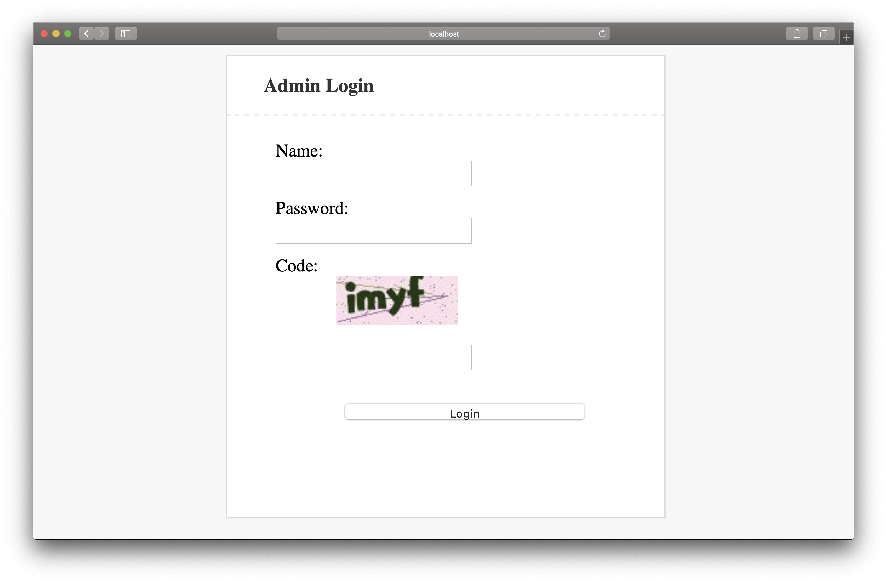
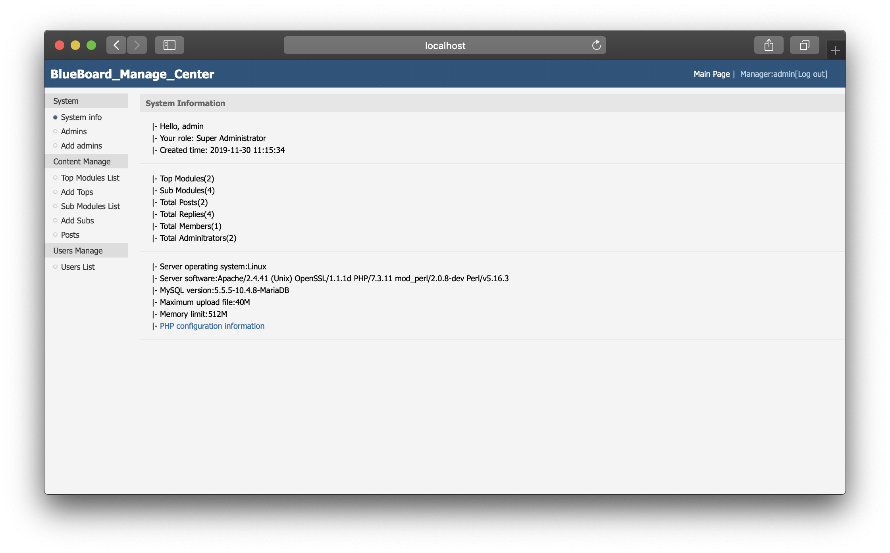

# BlueBoard
Term Project of CIS435

## Instruction of File Directories

       
## Structure of BlueBoard
### Main Web
Both visitors and BlueBoard Members can visit this website, and browse all posts. Only Members after login process can write post in different topics (submodules).

#### Functions in Main Web
1. Login & Logout & Register
2. View Top Modules & Sub Modules
3. Click Top Modules, publish posts
4. Click Sub Modules, publish posts
5. enter post page, reply posts
6. view user pages

### Management Web
Only administrators logged in can view the management page and manage the BlueBoard modules, posts and users.

#### Functions in Management Web
1. Login & Logout 
2. View system information
3. View administrators
4. Super administrators have permissions to add new admins
5. View top modules list, sort them in main page. Visit, modify or delete top modules.
6. Add top modules.
7. View sub modules list, sort them in main page. Visit, modify or delete top modules.
8. Add sub modules.
9. View all posts and modify or delete them.
10. View all users page, and delete users.
